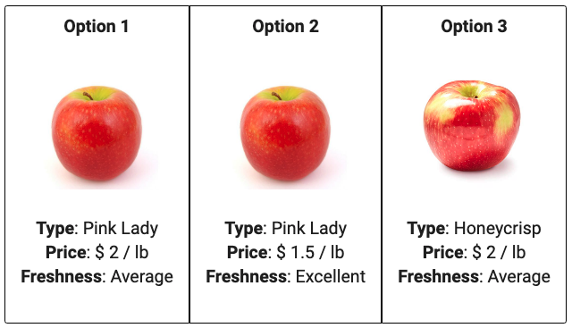

<!-- README.md is generated from README.Rmd. Please edit that file -->

# formr4conjoint

<!-- badges: start -->

[](http://creativecommons.org/licenses/by-nc-sa/4.0/)

<!-- badges: end -->

[formr](https://formr.org/) is a flexible platform for making surveys
using R. In this demo, I’m going to show you one way to use formr to
make a choice-based conjoint survey (if you’ve found this page, I’m
going to assume you know what that is).

Here’s the [live demo](https://appleconjoint.formr.org/) - a
choice-based conjoint survey about apples.

# Overview

Every formr survey starts with a spreadsheet. I highly recommend using
Google Sheets for this because

1.  formr has a button on the admin page to re-load your Google Sheet
    (otherwise you’d have to upload a .xlsx file)
2.  It’s easier for collaborating and managing different versions.

Each “survey” (each Google Sheet) must be loaded into a “Run” to make
the survey live. Most runs include multiple surveys together to control
complex logic. For this demo, I have set up the run as a combination of
three surveys (links below go to each respective Google Sheet):

-   [Part
    1](https://docs.google.com/spreadsheets/d/1tnt7IBSmOOe0wOZ8F6qN152yHYZMCBCo7_KQ3N1e-t8/edit#gid=1611481919):
    Intro and target population screen out
-   [Part
    2](https://docs.google.com/spreadsheets/d/1Ih3Pt6uz-gp5vc0SBxBzl4K0aZoRLwI6dtdtZiXSLz0/edit#gid=1611481919):
    Conjoint choice questions
-   [Part
    3](https://docs.google.com/spreadsheets/d/1t6DYMZsf6ZX6r5GVTBemZZhX1RlFTV6weM8w0LzwMK4/edit#gid=1611481919):
    Demographic and other questions

Don’t worry about what’s in each sheet just yet - we’ll get to that.

The run logic is as follows:

    Start (part 1)
      |
      V
    Check screen out question --> Screen out respondents not in target sample 
      |
      V
    Choice questions (part 2)
      |
      V
    Check choice responses --> Screen out respondents that chose all same responses
      |
      V
    Final demographic and other questions (part 3)
      |
      V
    Finish

Notice that there are two points where respondents can be screened out
of the survey:

1.  At the end of part 1, I ask a question to identify if the respondent
    is part of the target population I am interested in. This allows me
    to screen people out of the survey eary on before they get too far
    in if they’re not who I’m looking for. In this demo, I ask if they
    prefer the color Red or Blue and screen out people who chose Blue.
2.  At the end of part 2, I compute whether or not the respondent chose
    the same response for every choice question or not, which is a very
    good indicator that they were just clicking through the survey. I
    don’t want these respondents in my sample, so I screen them out
    here.

# Creating the surveys

To get started, I find it much easier to first make surveys using .Rmd
files - one .Rmd file per survey. You can then knit the .Rmd file to a
html page to preview the look and feel without having to use formr at
all. Then when you’re happy with how things look, copy-paste the content
over into separate rows in a Google Sheet.

For this demo, I designed the questions in each part using the following
three .Rmd files in the “survey” folder. The links in this table let you
compare the .Rmd file and the corresponding Google Sheet:

| .Rmd file                                                                                                      | Google Sheet                                                                                                                 |
|----------------------------------------------------------------------------------------------------------------|------------------------------------------------------------------------------------------------------------------------------|
| [p1-intro.Rmd](https://github.com/jhelvy/formr4conjoint/blob/master/survey/p1-intro.Rmd)                       | [appleConjoint\_p1](https://docs.google.com/spreadsheets/d/1tnt7IBSmOOe0wOZ8F6qN152yHYZMCBCo7_KQ3N1e-t8/edit#gid=1611481919) |
| [p2-choice-questions.Rmd](https://github.com/jhelvy/formr4conjoint/blob/master/survey/p2-choice-questions.Rmd) | [appleConjoint\_p2](https://docs.google.com/spreadsheets/d/1Ih3Pt6uz-gp5vc0SBxBzl4K0aZoRLwI6dtdtZiXSLz0/edit#gid=1611481919) |
| [p3-demos.Rmd](https://github.com/jhelvy/formr4conjoint/blob/master/survey/p3-demos.Rmd)                       | [appleConjoint\_p3](https://docs.google.com/spreadsheets/d/1t6DYMZsf6ZX6r5GVTBemZZhX1RlFTV6weM8w0LzwMK4/edit#gid=1611481919) |

# Designing the choice questions

The key component of every conjoint survey is the set of randomized
choice questions. To implement these in formr, you first need to define
the set of choice questions you want to ask each respondent. This is
done using the [conjointTools](https://jhelvy.github.io/conjointTools/)
package in the `make_choice_questions.R` file in the “survey” folder.
The resulting data frame of randomized choice questions is saved as the
`choice_questions.csv` file in the “survey” folder, which we’ll use to
define the choice questions inside a Google Sheet.

For this demo, the choice questions are designing to measure people’s
preferences for apples with three attributes: `type`, `price`, and
`freshness` (yes, people have [actually done conjoint surveys on
fruit](https://www.emerald.com/insight/content/doi/10.1108/00070709610150879/full/html)
before).

# Implementing the choice questions

The choice questions portion of the survey (see
[appleConjoint\_p2](https://docs.google.com/spreadsheets/d/1Ih3Pt6uz-gp5vc0SBxBzl4K0aZoRLwI6dtdtZiXSLz0/edit#gid=1611481919))
is the most complex part. The first few rows of this sheet runs the
following calculations to get the choice questions set up:

1.  Read in the full `choice_questions.csv` file. This one is hosted on
    Github, but you can also upload your `choice_questions.csv` file
    inside your Run (see the “Upload Files” button on the left side
    menu).
2.  Create a `respondentID` by sampling from all possible `respID`
    values in the choice questions.
3.  Create a new data frame (`df` in the sheet) that includes only the
    rows for the `respondentID`.
4.  Create a new `df_json` object that converts the `df` data frame to
    JSON. The reason this is necessary is because each new page on formr
    is basically a new R session, so all objects get erased when you
    start a new page. The only objects you have access to on separate
    pages are items that are stored in the resulting survey data, so we
    have to “serialize” the `df` object as one long JSON object so that
    we can access it later in other pages.

Once we have everything set up, we can then start defining choice
questions. In each choice question row, the first thing I do is define
the questions label and then write a code chunk to create multiple data
frames to store the values to display for each alternative. For example,
on row 10 of the
[appleConjoint\_p2](https://docs.google.com/spreadsheets/d/1Ih3Pt6uz-gp5vc0SBxBzl4K0aZoRLwI6dtdtZiXSLz0/edit#gid=1611481919)
Google Sheet, you can see the following code chunk under the question
label:

``` r
library(dplyr)
temp <- jsonlite::fromJSON(df_json)
alt1 <- temp %>% filter(qID == 1, altID == 1)
alt2 <- temp %>% filter(qID == 1, altID == 2)
alt3 <- temp %>% filter(qID == 1, altID == 3)
```

In this chunk, the `df_json` object is converted back into a data frame,
and then the `alt1`, `alt1`, `alt2`, and `alt3` data frames are created
by filtering out the rows for each corresponding alternative for
question 1. Each of these data frames are then used to display
information about each alternative. For example, the first alternative
is defined using this code:

``` r
**Option 1**

{width=100}

**Type**: `r alt1$type`
**Price**: $ `r alt1$price` / lb
**Freshness**: `r alt1$freshness`
```

When rendered in formr, the three options looks like this:

<center>

</center>

And that’s it! The only thing I have to do for the other choice
questions is update how each of the `alt` data frames are defined so
that they show the correct rows for question 2, question 3, etc.

# Implementing the surveys in formr

You’ll need to upload each Google Sheet survey into formr to convert
them into surveys. Go to your admin page, click on “Create Survey”, then
import one of the Google Sheets. This creates one survey. On the left
panel you can click “Test Survey” to preview it.

Once you have all three surveys loaded into formr, you can then assemble
them into a “Run” by clicking on “Runs -&gt; Create New Run”. Give the
run a name, then add your survey to the run by clicking on the

icon. You’ll want to add all three surveys, and then at the end add a
stopping point by clicking the

icon. You can use other logic to control how the user navigates through
the survey, such as a “Skip Forward”
(
icon) to screen respondents out before letting them get to a later part
of the survey.

The link to the survey will be `https://your_run_name.formr.org`. You
can control whether your survey is “live” or not by modifying the
“volume” icons. I recommend setting it to the

icon, which means people who have the link can access the survey.

## Author and License Information

-   Author: *John Paul Helveston* <https://www.jhelvy.com/>
-   Date First Written: *Monday, August 12, 2019*
-   This work is licensed under a [Creative Commons
    Attribution-NonCommercial-ShareAlike 4.0 International
    License](http://creativecommons.org/licenses/by-nc-sa/4.0/).

[](http://creativecommons.org/licenses/by-nc-sa/4.0/)
